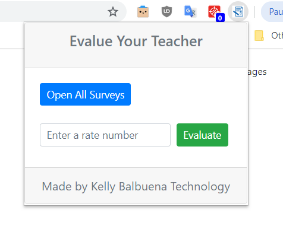
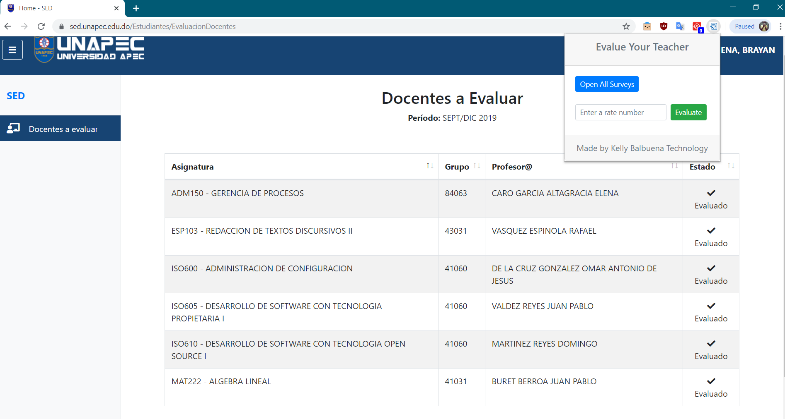
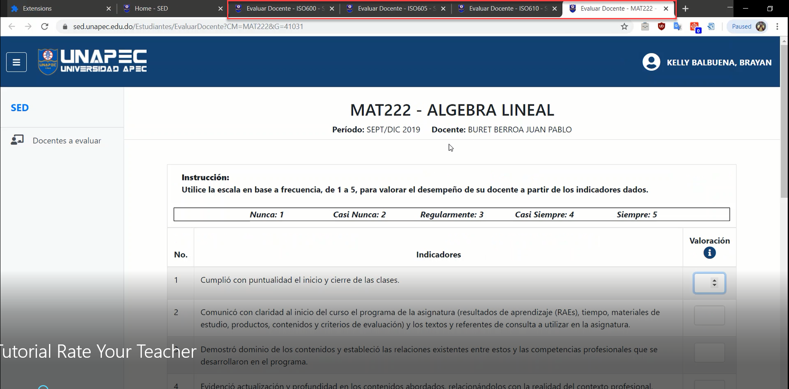
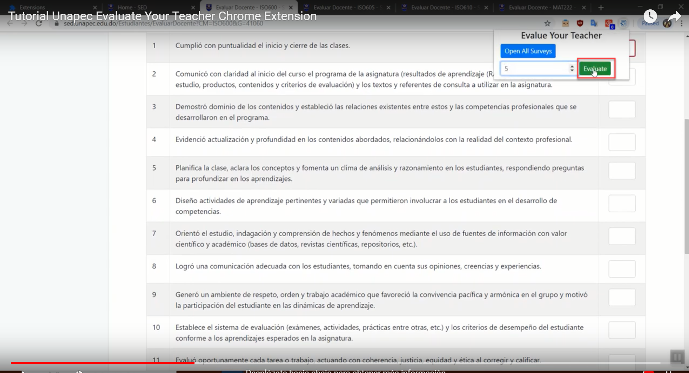
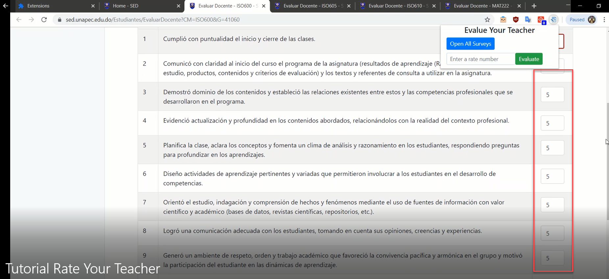
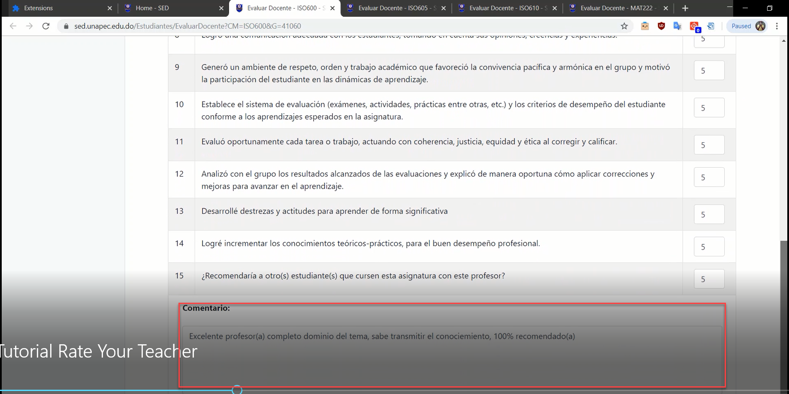

# evaluate-your-teachers

Extension for google chrome that allows you to automatically complete annoying teacher evaluations at Apec University

## ScreenShots

### [Video Tutorial](https://github.com/modelmapper/modelmapper)
### [Chrome Store link](https://chrome.google.com/webstore/detail/evaluate-your-teachers/mphaomgnoamhnfahbjopcbbhdcolknbj)

### Actual Features
* Open all surveys with only one click

* Accept from 1 to 5 rate number

* Fill all rate textbox

* Fill comment textbox with random phrase

### App Libraries
 * Jquery 3.4.1
 * Bootstrap 4.0.0

### Made with &#9829; by  Kelly Balbuena Technology SRL
